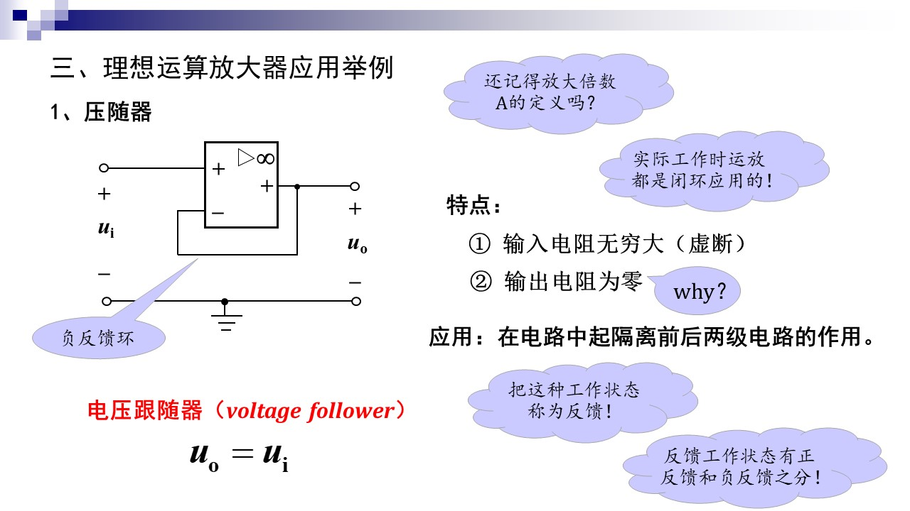
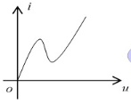

# 电路分析

## 1.绪论

### 绪论的绪论

$$
课程的性质、任务及地位
\begin{cases}
核心专业基础课（技术基础课）\\\\
电路理论是研究电网络分析、设计与综合的基础工程学科, 它属于电类各专业共同的理论基础。本课程是电路理论的入门课。\\\\
掌握电路分析的基本概念、基本理论和基本分析方法。
通过本课程的学习, 使学生掌握电路的基本理论知识、分析计算的基本方法和初步的实验技能, 为学习后续有关课程准备必要的电路知识, 并为进一步学习电路理论打下基础。\\\\
\text{本课程是电子信息类本科学生的第一门专业基础课。是后续课程"信号与线性系统”、“模拟电子电路”、“数字电路”等的基础。}

\end{cases}
$$

$$
\begin{cases}
电路\text{（circuit）：}为完成特定功能由导线将电的元器件互联而形成的电流通路，用来获取、传输和处理电信号和电能量。\\\\
电器件\text{（electric device）：}电的应用，无论是能量转换或信息传输处理，都要由电器件来实现。
\end{cases}
$$

$$
电路理论（电路原理）

\begin{cases}
电路分析(analysis) &已知输入和电路结构求解输出
\\\\
电路综合(synthesis)&已知输入和输出求解电路结构

\end{cases}
$$

$$
集总参数电路
\begin{cases}
集总电路:&由集总元件构成的电路\\\\
集总元件:&假定发生的电磁过程都集中在元件内部进行\\
    	&每一个具有两个端钮的元件中有确定的电流,端钮间有确定的电压。\\
    	&集总参数电路中,变量u、i可以是时间的函数,但与空间坐标无关\\\\
集总化判据:&\lambda \ge 100l
\end{cases}
$$

$$
约束
\begin{cases}
	VCR（伏安特性）
	\begin{cases}
		无源:R、C、L、M\\\\
		有源
		\begin{cases}
			独立源
			\begin{cases}
				理想电压源\\\\
				理想电流源
			\end{cases}\\\\
			受控源\\\\
			运算放大器
		\end{cases}
	\end{cases}\\\\
	拓扑约束
	\begin{cases}
		KCL: \Sigma{I}&=0\\\\
		KVL: \Sigma{U}&=0
	\end{cases}
\end{cases}
$$

### 电路分类

$$
电路分类\begin{cases}
	负载（响应）\begin{cases}
		电阻电路\begin{cases}
			线性电阻电路分析\\\\
			非线性电阻电路分析
		\end{cases}\\\\
		动态电路\begin{cases}
			感兴趣的时段\begin{cases}
				暂态分析\begin{cases}
					一阶电路\\\\
					二阶电路
				\end{cases}\\\\
				稳态分析\begin{cases}
					正弦电路稳态分析\\\\
					三相电路\\\\
					非正弦周期电路稳态分析
				\end{cases}
			\end{cases}
		\end{cases}
	\end{cases}\\\\
	电源（激励）\begin{cases}
		直流电路\\\\
		交流电路
	\end{cases}\\\\
	电路结构（拓扑）\begin{cases}
		单端口电路\\\\
		二端口电路
	\end{cases}
\end{cases}
$$

### 知识要点

### 电路系统分析方法

$$
电路系统分析方法\begin{cases}
	是什么系统\\\\
	系统组成\begin{cases}
		电路器件/元件\\\\
		连接方式
	\end{cases}\\\\
	系统分析变量\begin{cases}
		电流\\\\
		电压\\\\
		功率
	\end{cases}\\\\
	系统约束条件\begin{cases}
		元件特性\\\\
		基尔霍夫定理
	\end{cases}\\\\
	参考方向\\\\
	根据约束条件列写公式\\\\
	求解
\end{cases}
$$

### 电路的基本变量

习惯上直流用大写,
交流用小写

#### 电流current

带电质点有规律的运动形成电流

电流的大小用电流强度表示。
电流强度:单位时间内通过导体横截面的电荷量。
$$
i(t)= lim_{\Delta t\to 0} \frac{\Delta q}{\Delta t} = \frac{\text{d}q}{\text{d}t}
$$
单位 A 安[培]

#### 电压voltage

将点电荷$q$从A点移至B点电场力所做的功$W_{AB}$与该点电荷$q$的比值
$$
u_{AB}=\frac{\text{d}W_{AB}}{\text{d}q}
$$
单位 V 伏[特]

#### 电位potential

在电路中选一个参考点(reference point),(零电位点) 

而把任意一点到参考点的电压(降)称为该点的电位

### KVL

任意时刻，沿闭合回路电压降的代数和为零

任意时刻，沿闭合回路电压降的代数和等于电势升的代数和、

推论：电压的单值性
$$
\Sigma U=0 \ \text{or}\ \Sigma U=\Sigma U_s
$$

eg:

$$
u _ { 1 } - u _ { 2 } + u _ { s2 } + u _ { 3 } - u _ { s1 } = 0 \\
u _ { 1 } - u _ { 2 } + u _ { 3 } = u _ { s1 } - u _ { s2 }
$$

## 3.电阻元件

### 线性电阻：服从欧姆定律

(关联参考方向下)

$u = R* i$  $R$:电阻 $\Omega$: 单位

$i= G * u$ $G$: 电导 $S$: 单位西门子

VCR 伏安特性

伏安特性曲线: 欧姆定律的解析形式

### 电桥

电位相等节点可以短接

电流为0支路可以断开

(不影响电路的电压电流分布)

### 功率

(关联参考方向)
$$
p=ui=i^2R=\frac{u^2}{R}
$$
(非关联参考方向)
$$
p=-ui&= -(-Ri)*i=i^2R\\
&= -u(-\frac{u}{R})=\frac{u^2}{R}
$$
$p\ge 0$

### 线性电阻：服从欧姆定律

非线性电阻电路分析
$$
非线性电阻电路分析\begin{cases}
	分段线性法\\\\
	图解法\\\\
	小信号分析法（局部线性化近似法）
\end{cases}
$$

## 独立源

### [理想]电压源

$$
u(t)=u_s(t)
$$

参考方向非关联
$$
\begin{cases}
u与外电路无关\\\\
i由外电路决定\\\\
可以发出或吸收任意大功率,承载能力无限大
\end{cases}
$$

### [理想]电流源

$$
i(t) = i_S(t)
$$

$$
\begin{cases}
i与外电路无关\\\\
u由外电路决定\\\\
可以发出或吸收任意大功率,承载能力无限大
\end{cases}
$$

## 受控源

### 定义

电压源电压或电流源电流不是仅为时间的函数，而是受到电路中某支路或某元件的电压/电流控制

### 分类

### 功率

受控支路决定受控源的功率
$$
p=u _ { 1 } ( t ) i _ { 1 } ( t ) + u _ { 2 } ( t ) i _ { 2 } ( t ) = u _ { 2 } ( t ) i _ { 2 } ( t )
$$

### 与独立源区别

## 运算放大器 operational amplifier (Op Amp)

## 

### 运算放大器及其外特性

#### 端子含义

#### 端电压

#### 端电流

$$
i _ { + } + i_- + i _ { 0 } + i _ { u s +} + i _ { u s- } = 0
$$

#### 省略写法

工作在线性区时：
$$
\begin{cases}    { u _ { d } = u _ { + } - u _ { - } } \\ { u _ { 0 } = A _{u _ { d } }} \end{cases}
$$

$$
i _ { + } + i _ { - } + i _ { 0 } \ne 0
$$

#### $u_o$和$u_d$关系

分析时需非常关注

### 理想运算放大器

#### 条件

线性放大区，做如此理想化处理

#### 静态特性

### 运算放大器应用

### 

(3)一般工作在负反馈

## 动态元件的静态特性

### 电容(capacitor)

对一个二端子元件，如果在任一时刻t它的电荷q(t)同它的端电压u(t)之间的关系可用u-q平面上的一条曲线来确定，则此元件为电容元件。

### 线性电容

如果u一q曲线是一条通过原点的直线，且不随时间变化，则称为线性时不变电容元件。
$$
q(t)=C\cdot u(t)\\
\because i = \frac{\text d q}{\text d t}\\
\therefore i(t) = C \frac{\text d u}{\text d t}
$$
单位 法[拉] $F$ $\mu F$ $\text p F$

### 电感器

1.导线中有电流时，其周围就建立磁场。为增强磁场，通常把导线绕成线圈, 称为电感器或电感线圈。
2.磁场也存储能量。

### 电感元件(inductor)

1.是理想的电感器，它只具有产生磁通（存储磁能)的作用，而无其它任何作用。
2.一个二端元件，如果在任一时刻t,它的电流i(t)同它的磁链$\psi (t)$之间的关系可用$i-\psi$平面上的一条曲线来确定，则此二端元件称为电感元件。

### 线性电感

如果$i-\psi$曲线是一条通过原点的直线，且不随时间变化，则称为线性时不变电感元件。
$$
\psi (t)=L\cdot i(t)\\
\because u(t)=\frac{\text d \psi}{\text d t}\\
\therefore u(t)=L\cdot \frac{\text d\  i(t)}{\text d t}
$$
单位 $H$ 亨[利] $mH \ \mu H$

## 支路分析法

定义

1. 平面电路：能画在一个平面上，而又不致于有任何两条支路在非节点处相交的电路。否则就称为非平面电路。

2. 复杂电路：单纯利用串并联等效代换法不能化简为串联电路的电路。

   

支路分析法

1. 具有n个节点的复杂电路中独立KCL方程为（n-1）个

2. 电路中的网孔数就是独立回路数

3. 具有n个节点、b条支路的复杂电路中独立KVL方程为$b-(n-1)$个

4. 用元件VCR方程把方程中的变量统一用支路电流i或支路电压u变量表示

## 电路图

### 电路图

当采用关联方向时，只需标出一个量的方向。

### 有向线图(拓扑图)

定义：标明各支路电流、电压参考方向的电路结构图。

一个有向线图可对应许多不同的具体电路
具有相同有向线图的电路，应具有某些相同的特性
	有相同的基尔霍夫定律数学表达式
	满足特勒根定理

## 特勒根功率定理

对于一个具有n个节点和b条支路的电路，假设各支路电流和电压取关联参考方向，并令$(i_1, i_2,\dots,  i_b)$, $(u_1,u_2 \dots , u_b)$分别为各条支路的电流和电压，则对任何时间t,有：
$$
\sum _ { k = 1 } ^ { b } u _ { k } \cdot i_k = 0
$$

## 特勒根似功率定理

### 内容：

对于任意两个具有相同有向线图的网络$N$和$N'$,对应支路电压和电流乘积之和恒等于零。

若$(i_1,i_2, \dots, i_b)$, $(u_1, u_2, \dots, u_b)$网络$N$的支路电流、电压

  $(i_1',i_2', \dots, i_b')$,  $(u_1', u_2', \dots, u_b')$网络$N'$的支路电流、电压

则
$$
\sum _ { k = 1 } ^ { b } u _ { k }\cdot i _ { k }' = 0\\
 \sum _ { k = 1 } ^ { b } u _ { k }'\cdot i _ { k } = 0
$$

### 应用

对同一电路，相同时刻的量
对同一电路，不同时刻的量，或对具有相同有向图的不同电路间的量

## 端子和端口

### 单口网络

#### 定义

由两个端子（端钮）构成，且两个端子上流过电流大小相等、方向相反

#### 特性

$$
f ( u , i ) = 0
$$

只有两个端点（端钮）与其它电路相连的二端网络。当只注重端口的特性而不关心这个电路内部的具体情况时，称此二端网络为单（端）口网络，简称单口。

#### 端口连接

### 双口网络

对于一个四端子（端钮）的电路网络（如右图所示）如果满足：
$$
\{
\begin{array}\\
i_1=i_1'\\
i_2=i_2'
\end{array}
$$
则这个四端子网络称作二端口网络或双口网络。

**并不是所有四端子网络都是二端口网络**

#### 端口连接

### 多端口网络

## 电路的等效变换

### 定义

将复杂电路用一个具有相同的u一i关系的简单电路替代，它们对外电路来说是等效的

（VCR相同）

### 理想独立源的互联

### 有伴电源的等效变换

